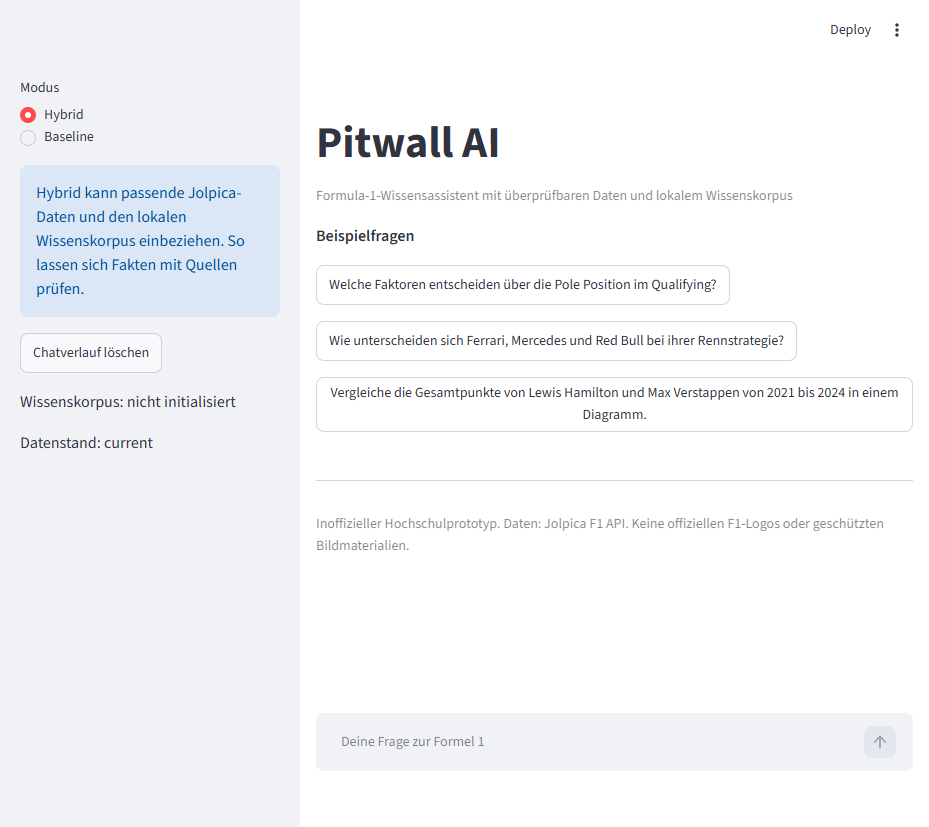
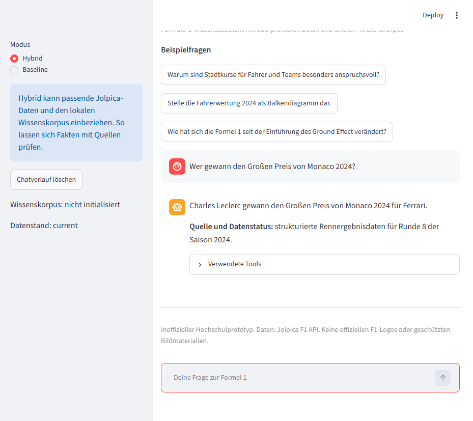
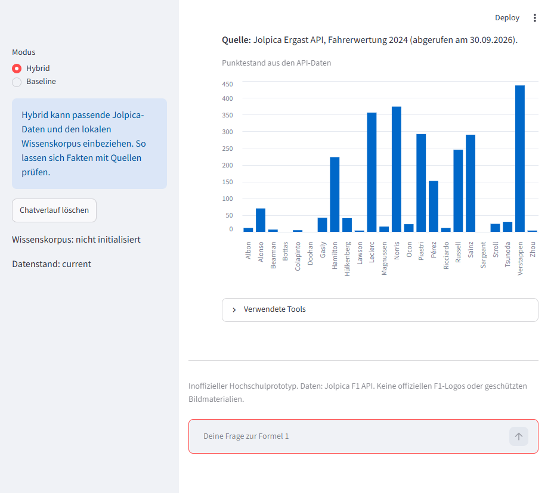

# Pitwall AI

Pitwall AI is a German-language university prototype for answering Formula 1 questions with verified Jolpica data, a local semantic knowledge corpus, and OpenAI tool calling.

## Features

- Hybrid tool calling and retrieval-augmented generation (RAG)
- Jolpica/Ergast-compatible API client with allow-listed paths, pagination, timeout, and retry handling
- Persistent Chroma knowledge store with stable document IDs
- Streamlit chat UI with Baseline and Hybrid modes
- Typed Pydantic models, pytest fixtures, Ruff configuration, and evaluation questions

## Screenshots

### Chat interface



### Verified API answer



### Driver standings and chart



## What the assistant can do

| User question | Routing | Result |
| --- | --- | --- |
| "Wer gewann Monaco 2024?" | `get_race_results` | Verified race result with source and data status |
| "Wie lautete die Fahrerwertung 2023?" | `get_driver_standings` | Ordered standings table |
| "Wo liegt Suzuka?" | `get_circuit_information` | Circuit and location data |
| "Vergleiche Hamilton und Verstappen" | `compare_drivers` | Bounded cross-season comparison |
| "Was ist ein Sprint-Wochenende?" | `search_knowledge_base` | Local background explanation |
| "Wer gewinnt die Fußball-WM?" | No tool | Brief scope limitation instead of guessing |

The assistant chooses a typed tool or local retrieval. It never accepts a model-generated URL and treats retrieved content as data, not instructions.

## Process chain

```text
German question -> Streamlit chat -> OpenAI Responses API
				 -> validated Jolpica tool or local Chroma search
				 -> German answer with source and retrieval timestamp
```

## Architecture

The model may call typed tools for numeric and historical facts. Background explanations use the local corpus. API results and retrieved documents are data only and never override the system prompt. See [docs/architecture.md](docs/architecture.md).

## Requirements

Python 3.12, an OpenAI API key with access to the configured model, and network access to Jolpica for synchronization. The application starts without a corpus and explains how to create one.

## Installation

Windows:

```bat
install.bat
copy .env.example .env
```

The batch files use `.venv\Scripts\python.exe` directly. No PowerShell activation and no Execution Policy change are required.

macOS/Linux:

```bash
python3.12 -m venv .venv
source .venv/bin/activate
python -m pip install -e '.[dev]'
cp .env.example .env
```

Set `OPENAI_API_KEY` and `OPENAI_MODEL` in `.env`. The model name is intentionally not hard-coded because availability depends on the API account.

## Data synchronization

```bash
python scripts/sync_f1_data.py
```

`F1_START_SEASON`, `F1_END_SEASON`, `data/raw/`, `data/processed/`, and `CHROMA_PATH` control the synchronization. Re-running it upserts stable document IDs.

## Run

```bat
start.bat
```