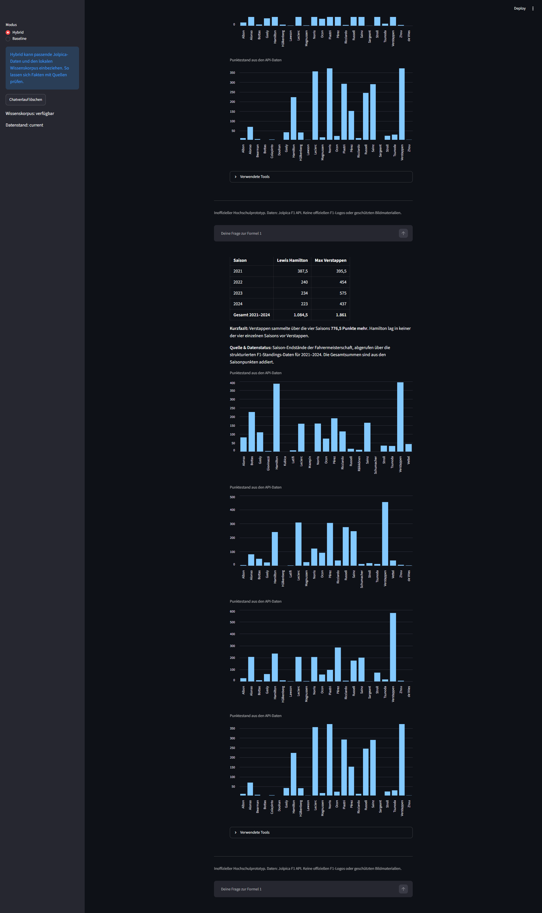

# Pitwall AI

Pitwall AI ist ein deutschsprachiger Formel-1-Assistent für eine Hausarbeit im Masterstudiengang Wirtschaftsinformatik. Die Streamlit-Anwendung verbindet ein Sprachmodell mit der Jolpica-API und einer lokalen Wissenssuche (RAG).

## Voraussetzungen

- Python 3.12 mit `pip` und dem Windows-Launcher `py`
- OpenAI-API-Schlüssel mit Zugriff auf das gewünschte Modell
- Internetverbindung

Die OpenAI-API-Nutzung kann Kosten verursachen.

## Installation und Start unter Windows

Alle Befehle im Projektordner in PowerShell ausführen.

### 1. Abhängigkeiten installieren

```powershell
.\install.bat
```

Das Skript erstellt `.venv` und installiert die benötigten Pakete.

### 2. Zugang konfigurieren

Falls noch keine `.env` vorhanden ist, die Vorlage kopieren:

```powershell
copy .env.example .env
```

Anschließend in `.env` die folgenden Werte eintragen:

```dotenv
OPENAI_API_KEY=<eigener API-Schlüssel>
OPENAI_MODEL=<Modellname mit Zugriff im eigenen API-Konto>
```

Die Platzhalter ersetzen. Die `.env` mit dem API-Schlüssel nicht mit abgeben.

### 3. Anwendung starten

```powershell
.\start.bat
```

Die Oberfläche ist standardmäßig unter `http://localhost:8501` erreichbar. Zum Beenden im Terminal `Strg+C` drücken.

## Dokumentation

- [Hausarbeitskonzept](docs/hausarbeit-konzept.de.md)
- [Systemarchitektur](docs/architecture.md)
- [Evaluationsanleitung](docs/evaluation.md)
- [Evaluationsbericht](docs/evaluation-report.md)

## Abbildungen




