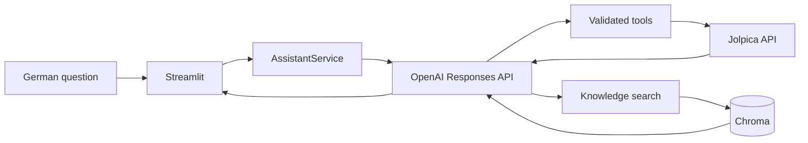

# Architecture

## Components

`Streamlit` presents the German chat. `AssistantService` selects Baseline or Hybrid generation through the OpenAI Responses API. `tool_registry.py` exposes only JSON-schema tools implemented in `tools.py`. `JolpicaClient` is the replaceable source adapter. `VectorStore` wraps persistent Chroma and can be absent at startup. `ingestion.py` writes raw JSON and normalized documents.

## Data flow

## Tool-calling flow

The model receives the system prompt and JSON schemas. A function call is parsed, validated, dispatched through a fixed mapping, and returned as structured JSON with source and retrieval timestamp. No model-controlled URL is accepted.

The UI intentionally remains usable before configuration: without `OPENAI_API_KEY` and `OPENAI_MODEL`, it displays a setup message instead of raising a traceback. With both values configured, it creates the official OpenAI Python client and passes it to `AssistantService`.

## RAG flow

Synchronization downloads selected seasons, writes raw responses, builds deterministic documents, and upserts them into Chroma. Retrieval is limited to five results and is explicitly untrusted context.

## Decisions and alternatives

The Responses API is used because it provides a current official Python interface for tool calls. `httpx` and Pydantic keep the source boundary testable. Chroma is local and appropriate for a prototype; a managed vector database could replace it later. A deterministic rule router would be cheaper but less representative for the research question, so model routing is retained with strict tools.
