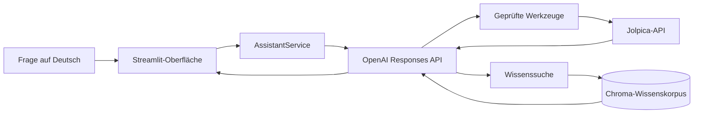

# Architektur

## Komponenten

`Streamlit` stellt den deutschsprachigen Chat bereit. `AssistantService` wählt über die OpenAI Responses API zwischen der Generierung in den Modi Baseline und Hybrid. `tool_registry.py` stellt ausschließlich Werkzeuge mit JSON-Schema bereit, die in `tools.py` implementiert sind. `JolpicaClient` kapselt die austauschbare Datenquelle. `VectorStore` bindet den dauerhaft gespeicherten Chroma-Wissenskorpus ein und darf beim Start fehlen. `ingestion.py` speichert unveränderte JSON-Antworten und normalisierte Dokumente.

## Datenfluss

## Ablauf der Werkzeugaufrufe

Das Modell erhält die Systemanweisung und die JSON-Schemas. Ein Werkzeugaufruf wird eingelesen, validiert, über eine feste Zuordnung ausgeführt und als strukturiertes JSON mit Quelle und Abrufzeitpunkt zurückgegeben. Vom Modell vorgegebene URLs werden nicht akzeptiert.

Die Oberfläche bleibt auch vor der Konfiguration nutzbar: Fehlen `OPENAI_API_KEY` oder `OPENAI_MODEL`, wird eine Konfigurationsmeldung angezeigt, statt einen Fehlerbericht auszugeben. Sind beide Werte gesetzt, wird der offizielle OpenAI-Python-Client erstellt und an `AssistantService` übergeben.

## Ablauf des Wissensabrufs (RAG)

Die Synchronisierung lädt ausgewählte Saisons herunter, speichert die unveränderten Antworten, erstellt reproduzierbare Dokumente und fügt sie in Chroma ein oder aktualisiert sie dort. Der Wissensabruf ist auf fünf Treffer begrenzt; die abgerufenen Inhalte gelten ausdrücklich als nicht vertrauenswürdiger Kontext.

## Architekturentscheidungen und Alternativen

Die Responses API wird verwendet, weil sie eine aktuelle offizielle Python-Schnittstelle für Werkzeugaufrufe bietet. `httpx` und Pydantic halten die Abgrenzung zur Datenquelle testbar. Chroma wird lokal betrieben und eignet sich für einen Prototyp; später könnte eine verwaltete Vektordatenbank eingesetzt werden. Eine deterministische regelbasierte Weiterleitung wäre kostengünstiger, für die Forschungsfrage jedoch weniger repräsentativ. Daher bleibt die modellbasierte Auswahl mit strikt validierten Werkzeugen erhalten.
